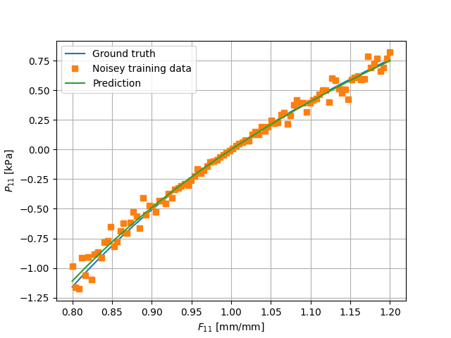

A first NCM
===========

.. _COMMET paper: https://arxiv.org/abs/2510.00884
.. _Can KAN CANs paper: https://www.doi.org/10.1016/j.cma.2025.118089
.. _ICNN paper: https://proceedings.mlr.press/v70/amos17b.html
.. _NN-EUCLID paper: https://www.doi.org/10.1016/j.jmps.2022.105076

We have, so far, covered the basic input file schema for COMMET in  :ref:`helloworld` and the approach for defining custom material models in :ref:`defining material models`.
In this example, we demonstrate the following:

* How to create a basic NCM.
* How to train an NCM on some data in a supervised manner.
* How to then use that NCM in a COMMET simulation.

Example files 
-------------

The files for running the example can be downloaded as a single zip file `here <../../_static/a_first_ncm.zip>`_
and it contains the following files:

| . 
| ├── ncm.torchscript
| ├── training.py
| └── a_first_ncm.jsonc 

Problem definition
------------------

The problem definition is similar to that the Hello World example (see :ref:`helloworld`) in geometry and boundary conditions.
However, we will model the material behaviour using an NCM that has been trained on some synthetic data.  

Defining the NCM
----------------

The NCM will make use of isochoric invariants as the input (or the `kinematic layer`) and a monotonically increasing input convex neural network (MICNN) as the inner network, see the `COMMET paper`_ for more details.
More specifically, we define the isochoric right Cauchy-Green tensor as

.. math::

   \tilde{\mathbf{C}} := \mathbf{C} (\det{\mathbf{C}})^{-1/3}\,,

and the isochoric first and second invariants, respectively, as

.. math::

   \tilde{I}_1 := \text{tr}(\tilde{\mathbf{C}})\,,\qquad \tilde{I}_2 := \frac{1}{2}\left(\text{tr}(\tilde{\mathbf{C}})^2 -\text{tr}(\tilde{\mathbf{C}}^2)\right)\,.

We then define the kinematic layer as follows:

.. math::

   \mathcal{K}(\mathbf{F}) = \begin{bmatrix} \tilde{I}_1 - 3 \\ \tilde{I}_2^{3/2} - 3^{3/2} \\ (\det(\mathbf{C})^{1/2}-1)^{2} \end{bmatrix}

Here, we use :math:`\tilde{I}_2^{3/2}` as opposed to simply :math:`\tilde{I}_2` since the former is polyconvex in :math:`\mathbf{F}` and the latter is not (see e.g. the `Can KAN CANs paper`_ and the references therein for comment and discussion on this).

Since the inputs to the inner network as themselves polyconvex, we require that the inner network is convex and monotonically increasing with respect to its input for the resulting model to be polyconvex.
One such network is obtained by using input convex neural networks, or ICNNs (see the `ICNN paper`_ or the `NN-EUCLID paper`_) but by constraining the weights in the skip connections to be positive in addition to the weights in the pass through layers.

Overall this leads to the NCM being defined as in the following listing which is a snippet from the `training.py` file

.. code-block:: python
   :linenos:

    import torch
    from torch import nn
    from typing import Union, List, Callable, Optional

    class ConvexLinear(nn.Module):

        def __init__(self,
                     size_in: int,
                     size_out: int,
                     use_bias=True):
            super(ConvexLinear, self).__init__()
            self.size_in: int = size_in
            self.size_out: int = size_out
            weights: torch.Tensor = torch.Tensor(size_out, size_in)
            self.weights = torch.nn.Parameter(weights)

            self.use_bias = use_bias

            if self.use_bias:
                self.bias = torch.nn.Parameter(torch.Tensor(size_out))

            else:
                self.bias = None

            torch.nn.init.kaiming_uniform_(self.weights, a=5**0.5)

        def forward(self, x: torch.Tensor) -> torch.Tensor:
            result = torch.mm(x, torch.nn.functional.softplus(self.weights.t()))
            if self.bias is not None:
                result = result + self.bias

            return result

    class MICNN(nn.Module):
        def __init__(self,
                     n_inputs: int,
                     n_outputs: int,
                     hidden_architecture: List[int] = [],
                     activation_function: Callable = torch.nn.functional.softplus):
            super(MICNN, self).__init__()

            self.n_inputs: int = n_inputs
            self.n_outputs: int = n_outputs
            self.activation_function: Callable = activation_function

            self.architecture = [self.n_inputs] + \
                hidden_architecture + [self.n_outputs]

            self.n_hidden_layers = len(hidden_architecture) - 1

            self.first_layer = ConvexLinear(self.n_inputs, self.architecture[1])

            self.layers = torch.nn.ModuleList([ConvexLinear(hidden_architecture[i],
                                                            hidden_architecture[i+1])
                                               for i in range(self.n_hidden_layers)])
            self.last_layer = ConvexLinear(self.architecture[-2], self.n_outputs)

            self.skip_layers = torch.nn.ModuleList([ConvexLinear(self.n_inputs,
                                                                 hidden_architecture[i+1],
                                                                 use_bias=False)
                                                    for i in range(self.n_hidden_layers)])
            self.last_skip = ConvexLinear(self.n_inputs, self.n_outputs)

        def forward(self, x: torch.Tensor):
            z = self.first_layer(x)

            for layer, skip_layer in zip(self.layers, self.skip_layers):
                z = self.activation_function(layer(z) + skip_layer(x))

            z = self.last_layer(z) + self.last_skip(x)

            return z

    class InvariantBasedNCM(nn.Module):
        def __init__(self,
                     inner_network: nn.Module):
            super(InvariantBasedNCM, self).__init__()
            self.inner_network: nn.Module = inner_network

        def get_K_from_C(self, C: torch.Tensor) -> torch.Tensor:

            C = 0.5*(C + C.transpose(1, 2))

            I3 = torch.det(C)
            C = C*I3[:, None, None]**(-1/3)

            I1 = torch.sum(C[:, [0, 1, 2], [0, 1, 2]], dim=1)

            C2 = torch.bmm(C, C)
            I2 = 0.5*(I1**2 - torch.sum(C2[:, [0, 1, 2], [0, 1, 2]], dim=[1]))

            J = torch.sqrt(I3)

            return torch.stack([
                I1-3,
                I2 ** (3/2) - (3 ** (3/2)),
                (J-1) ** 2
            ],
                dim=1)

        @torch.jit.export
        def W_NN_from_C(self,
                        C: torch. Tensor,
                        structural_vectors: Optional[torch.Tensor] = None) -> torch.Tensor:
            return self.inner_network(self.get_K_from_C(C))

        @torch.jit.export
        def W_NN_from_F(self,
                        F: torch. Tensor,
                        structural_vectors: Optional[torch.Tensor] = None) -> torch.Tensor:
            C = torch.bmm(F.transpose(1, 2), F)
            return self.W_NN_from_C(C, structural_vectors)

        def forward(self, F: torch.Tensor):
            return self.W_NN_from_F(F)

    if __name__=="__main__":

        inner_network = MICNN(n_inputs=3,
                              n_outputs=1,
                              hidden_architecture=[16, 16])
        ncm = InvariantBasedNCM(inner_network)

Training the NCM
----------------

As a didactic example, we will train the NCM on synthetic data obtained from a Gent-Thomas material model. 
The Gent-Thomas model is implemented similarly to the Neohookean model in :ref:`defining material models`. 
However, the strain energy density is given by

.. math::

        \Psi(\mathbf{F}) =  c_1(\tilde{I}_1-3) + c_2\log(\tilde{I}_2/3) + \frac{1}{2}\kappa(\det(\mathbf{C})^{1/2}-1)^2

We create some synthetic training data with the following code snippet.

.. code-block:: python
   :linenos:

    def get_stress(ncm: Union[InvariantBasedNCM, GentThomas],
                   F: torch.Tensor) -> torch.Tensor:
        F = F.detach().requires_grad_(True)
        energy = ncm.W_NN_from_F(F)
        P = torch.autograd.grad(energy,
                                F,
                                torch.ones_like(energy),
                                create_graph=True)[0]
        return P

    gent_thomas_model = GentThomas()

    dim = 3

    F_uni = torch.zeros(100, dim, dim)
    for i in range(dim):
        F_uni[:, i, i] = 1

    F_uni[:, 0, 0] = torch.linspace(.8, 1.2, F_uni.shape[0])

    noise_scale = 0.1
    P_data = get_stress(gent_thomas_model, F_uni)
    P_data_noisey = P_data + P_data*torch.randn(P_data.shape)*noise_scale

Finally, we instantiate, train, and export the NCM to torchscript with the following code snippet 

.. code-block:: python
   :linenos:

    inner_network = MICNN(n_inputs=3,
                          n_outputs=1,
                          hidden_architecture=[16, 16])
    ncm = InvariantBasedNCM(inner_network)

    optim = torch.optim.Adam(ncm.parameters(), lr=0.5)

    for i in range(4000):
        optim.zero_grad()
        P_pred = get_stress(ncm, F_uni)
        loss = torch.nn.functional.mse_loss(P_pred, P_data_noisey.detach())
        print(f"{i=}\t{loss.item()=}")
        loss.backward()
        optim.step()

    traced = torch.jit.trace(ncm, (F_uni, ))
    traced.save("ncm.torchscript")

    P_pred_uni = get_stress(ncm, F_uni)

    plt.plot(F_uni[:, 0, 0].detach().cpu(), P_data[:, 0, 0].detach().cpu(), label="Ground truth")
    plt.plot(F_uni[:, 0, 0].detach().cpu(), P_data_noisey[:, 0, 0].detach().cpu(), label="Noisey training data", marker='s', linewidth=0)
    plt.plot(F_uni[:, 0, 0].detach().cpu(), P_pred_uni[:, 0, 0].detach().cpu(), label="Prediction")

    plt.xlabel("$F_{11}$ [mm/mm]")
    plt.ylabel("$P_{11}$ [kPa]")
    plt.grid()
    plt.legend()

The resulting behaviour is displayed alongside the data in the figure below.

The input file
--------------

The input file is almost identical to that in :ref:`defining material models`, all that changes is the path to the torchscript file: :code:`"path_to_torchscript":"ncm.torchscript"`.

Running the simulation
----------------------

If you are using docker, you can run the example by going to the directory containing the input file and running

.. code-block:: console

   $ docker run --rm -v ./:/data -w /data commetcode/commet_solve mpirun -n <n_procs_to_use> commet_solve a_first_ncm.jsonc

If, instead, you have build COMMET locally and it is in your path, you can run

.. code-block:: console

   $ mpirun -np <n_procs_to_use> commet_solve a_first_ncm.jsonc

