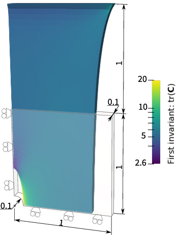

.. _helloworld:
Hello world: running a simulation without an NCM
================================================

This first example is designed to give users a simple first exposure to the input file interface -- it can be thought of as a ''hello world'' equivalent.
The learning outcomes are as follows:

* First exposure to the COMMET input file schema
* Using built-in meshes
* Defining traditional (not NCM) hyperelastic material models 
* Defining Dirichlet boundary conditions
* Choosing field outputs

Example files 
-------------

The files for running the example can be downloaded as a single zip file `here <../../_static/hello_world.zip>`_
and it contains the following files:

| .
| └── hello_world.jsonc

Problem definition
------------------
We simulate a square plate with a hole in its centre and utilize quarter-symmetry. 
The problem is displayed schematically in the figure below.

.. TODO: Change fig so that doesn't have current configuration and applied displacement is shown

The plate consists of a Neohookean material with the following strain energy density function

.. math::

   \Psi(\mathbf{C}) = \frac{\mu}{2}\left[I_1 - 3 - \log(I_3)\right] + \frac{\lambda}{4}\left[I_3 -1 -\log(I_3)\right] \,.

Here, :math:`\mu` and :math:`\lambda` are material parameters, and :math:`I_1=\text{tr}(\mathbf{C})` and :math:`I_3=\text{det}(\mathbf{C})`.

The input file
--------------

COMMET uses JSON (or JSON with comments) for input files -- the file extension "\*.json" denotes a standard JSON file whereas "\*.jsonc" denotes JSON with comments.
In each input file, there are several sections that may be defined.
The sections that are defined in this example are `mesh`, `materials`, `stages`, and `outputs`.

The input file to define the problem is shown below with explanatory comments. 

.. code-block:: json
   :caption: Content of hello_world.jsonc
   :linenos: 

    {
    // Defining the mesh 
    "mesh": {
        // Indicating that we will use a built-in mesh (not reading one in from file)
        "from": "built-in", 
        // The type of built-in mesh that we will use
        "type": "quarter_plate_with_hole",
        // The order of the finite elements to use
        "order": 1,
        // Radius of the hole in the plate
        "radius": 0.2,
        // Length of the plate
        "length": 1,
        // Thickness of the plate
        "thickness": 0.1,
        // The number of times to refine the mesh of the geometry in-plane
        "planar_refinements": 1,
        // The number of times to refine the mesh of the geometry globally (through the thickness and in-plane)
        "global_refinements": 1
    },
    // Defining the materials
    "materials": [
        {
            "id": 0, // The id of the region for which this material applies
            "type": "traditional", // Either "traditional" or "ncm"
            "elasticity": { // Defines the elastic portion of the behaviour
                "type": "neohookean",
                "mu": 77,
                "lambda": 115
            }
        }
    ],
    // Defining the boundary conditions to be applied over time
    "stages": [
        {
            "end_time": 1,
            "time_increment_size": 0.1,
            "dirichlet_boundary_conditions": [
                 {
                     "type": "standard", // Either "standard" or "pull_twist"
                     "boundary_id": 1, // The id of the boundary to which this condition applies
                     "components": [0], // The components (0->x, 1->y, 2->z) of the displacement to be prescribed.
                     "values": [0] // The values of the prescribed displacement. Must have the same number of entries as "components"
                 },
                 {
                     // Similar to above
                     "type": "standard",
                     "boundary_id": 2,
                     "components": [1],
                     "values": [0]
                 },
                 {
                     // Similar to above
                     "type": "standard",
                     "boundary_id": 3,
                     "components": [2],
                     "values": [0]
                 },
                 {
                     // Similar to above
                     "type": "standard",
                     "boundary_id": 4,
                     "components": [0, 1, 2],
                     "values": [1, 0, 0]
                 }
            ],
            "neumann_boundary_conditions": [],
            "robin_boundary_conditions": []
        }
    ], 
    // Defining the fields to be output
    "outputs": {
         "scalar_outputs": ["I1"], // Scalar fields to output (here I1=\tr(C))
         "vector_outputs": [ ], // Vector fields to output
         "tensor_outputs": ["kirchhoff_stress", "C" ] // Tensor fields to output
     }
    }

Running the simulation
----------------------

If you are using docker, you can run the example by going to the directory containing the input file and running

.. code-block:: console

   $ docker run --rm -v ./:/data -w /data commetcode/commet_solve mpirun -n <n_procs_to_use> commet_solve hello_world.jsonc

If, instead, you have build COMMET locally and it is in your path, you can run

.. code-block:: console

   $ mpirun -np <n_procs_to_use> commet_solve hello_world.jsonc

